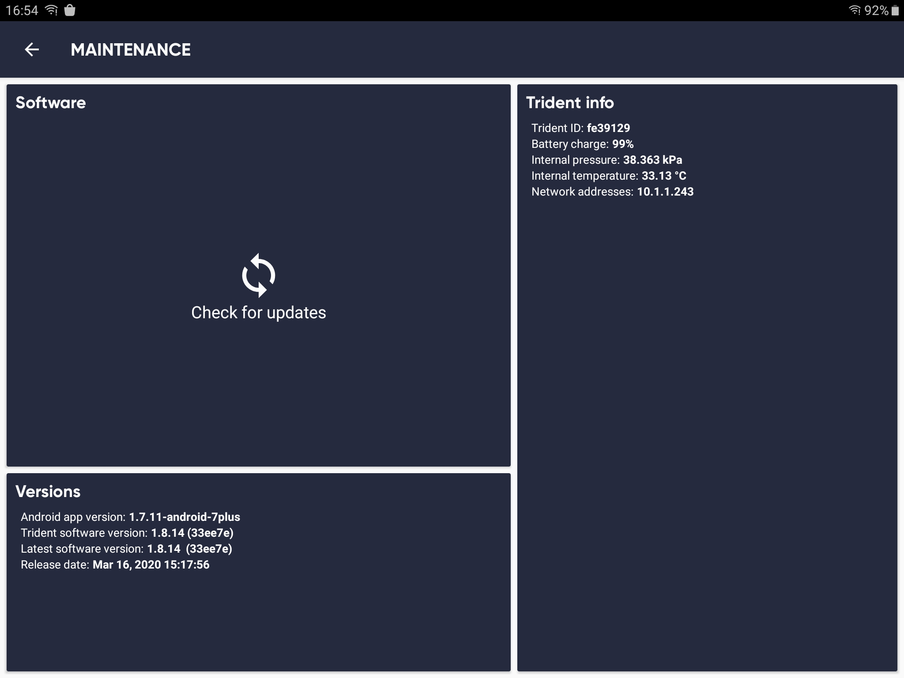
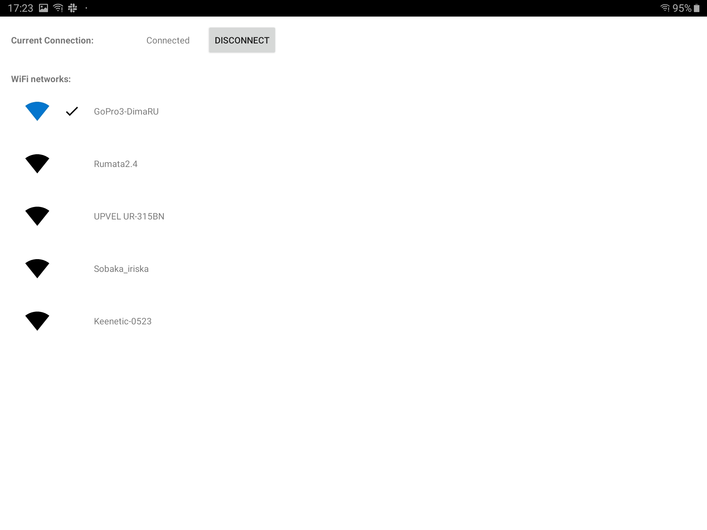
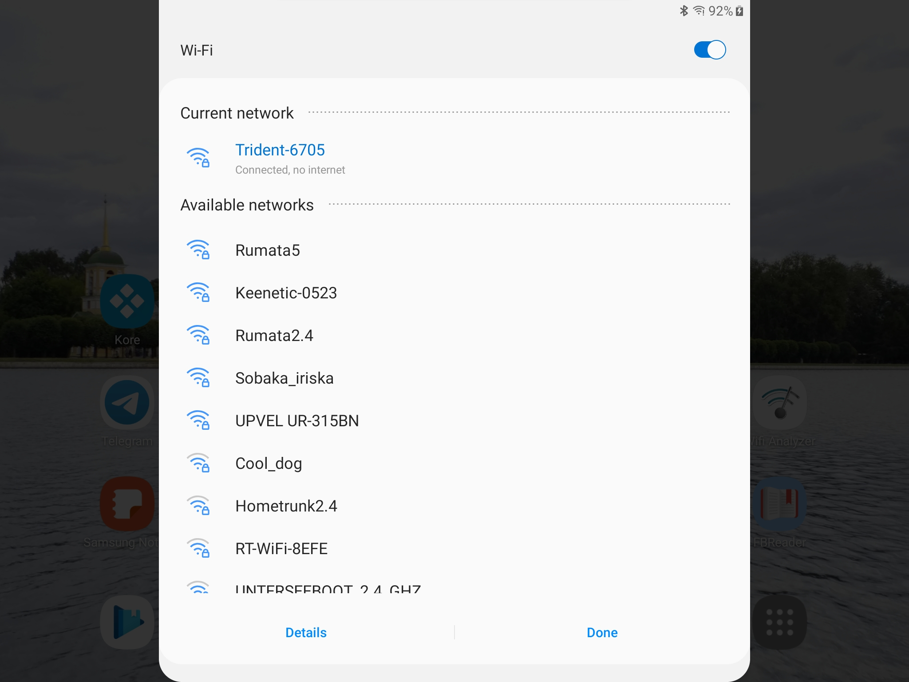
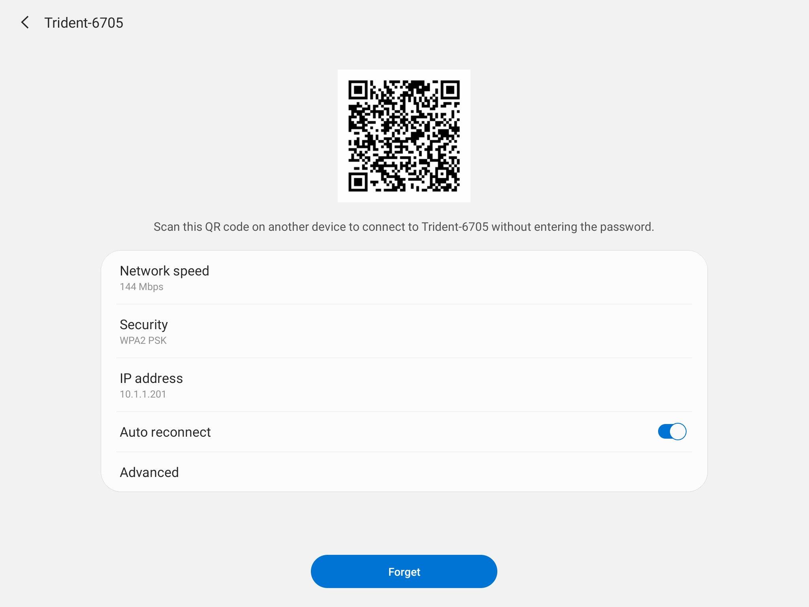
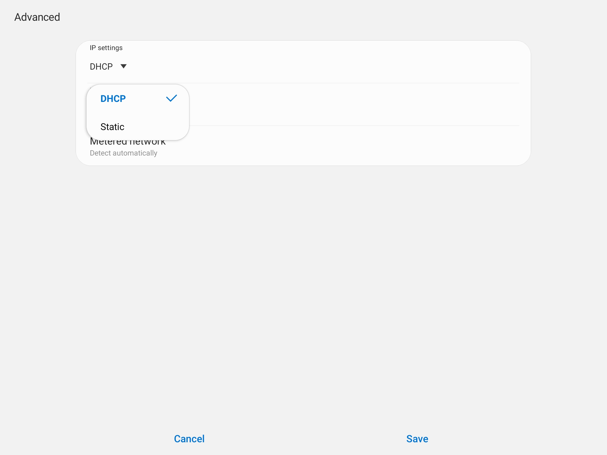
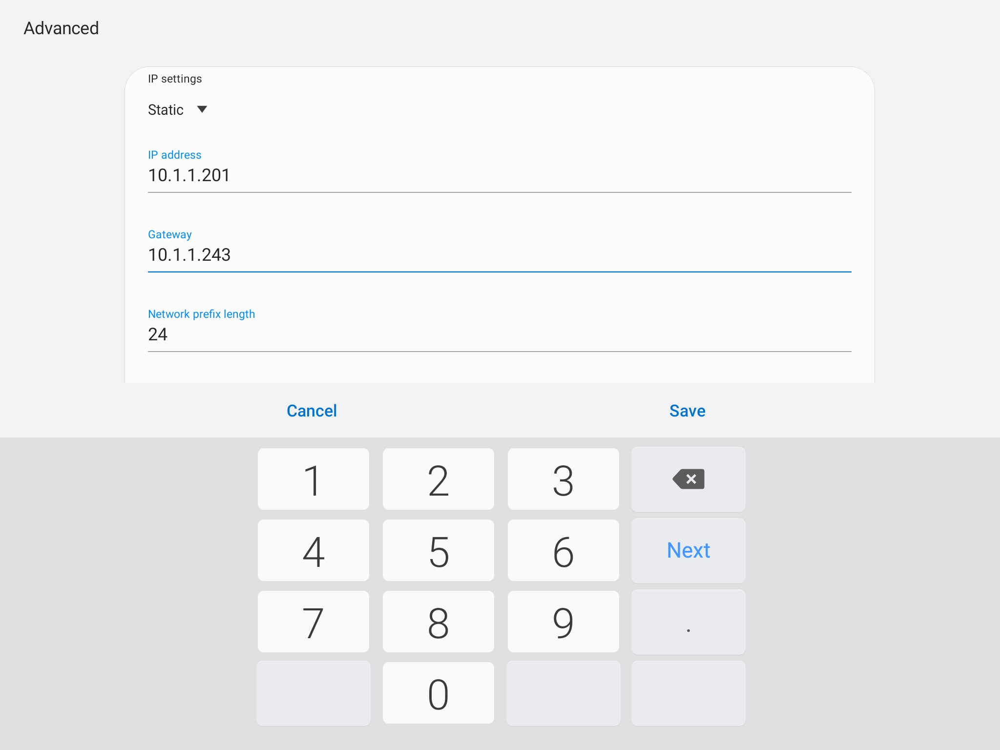
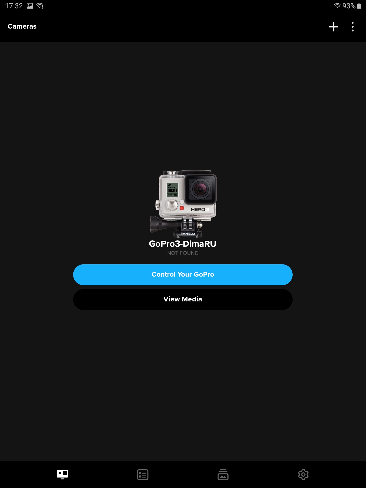

# Use GoPro official Android app with Trident Drone.


1. First, connect to Trident Drone, use Trident Cockpit android app:
[](#)
2. Connect your GoPro to the Tridrent Drone onboard WiFi:
[](#)
3. Open WiFi connections menu, tap to Trident connection:
[](#)
4. Tap to `Advanced` setting:
[](#)
5. Change connection type from `DHCP` to `Static`:
[](#)
6. Change `Gateway` from `10.1.1.1` to `1.1.1.243`:
[](#)
7. Download [gopro.sh](gopro.sh) script to the Trident drone using sftp.
8. Enter Trident shell by ssh, use `OpenROV` password:
&nbsp;
```bash
ssh rov@10.1.1.243
```
9. Make it executable and execute it:
&nbsp;
```bash
chmod +x gopro.sh
sudo gopro.sh
```
10. Then you may use offical GoPro app to control your camera:
[](#)
